# ZIK
Złoty Indeks Kieleckiego - project to confirm hypothesis that:
* Inflation in Poland is bigger than what is offically presented
* Gold preserve its value during time
So for ounce of gold you can buy the same (similar) number of liters of Kielecki mayonaise (https://pl.wikipedia.org/wiki/Majonez_Kielecki). today and in 100 years (doesn't matter if official currency would still be złoty, dollars, bitcoin, sea mushels or anything else.

## Kielecki

## Aspiryna
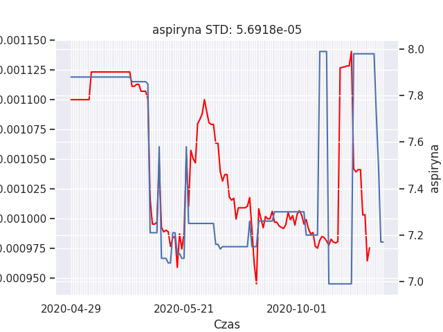
## BigMac
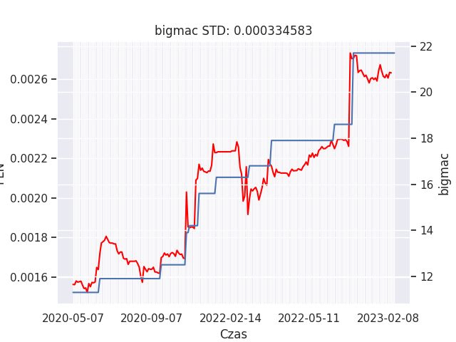
## Fryzjer
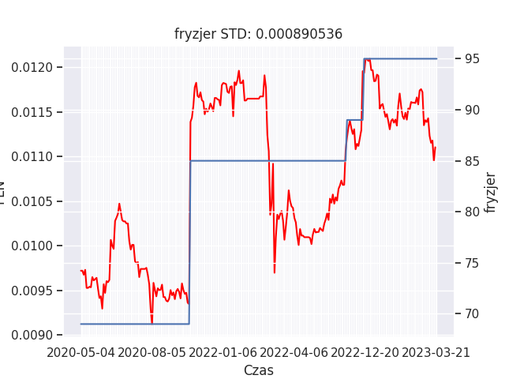
## Kasjer
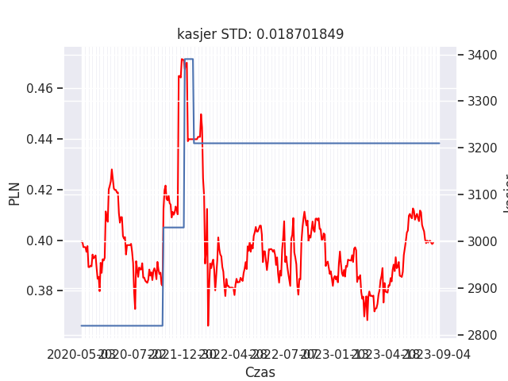
## buty
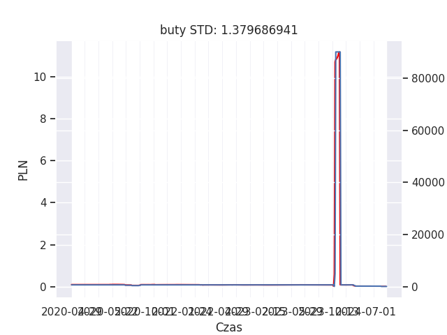
## jablka
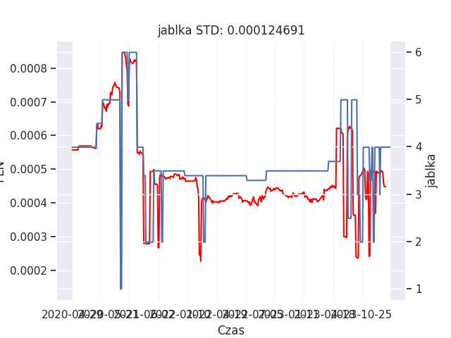
## makaron
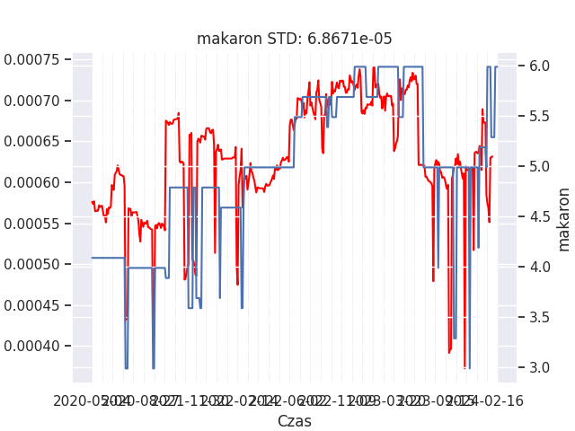
## maslo
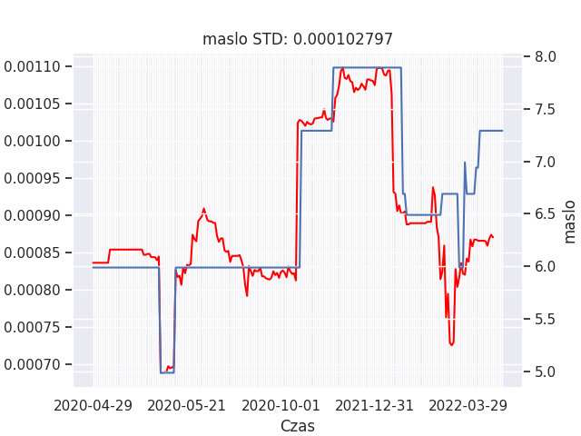
## upc
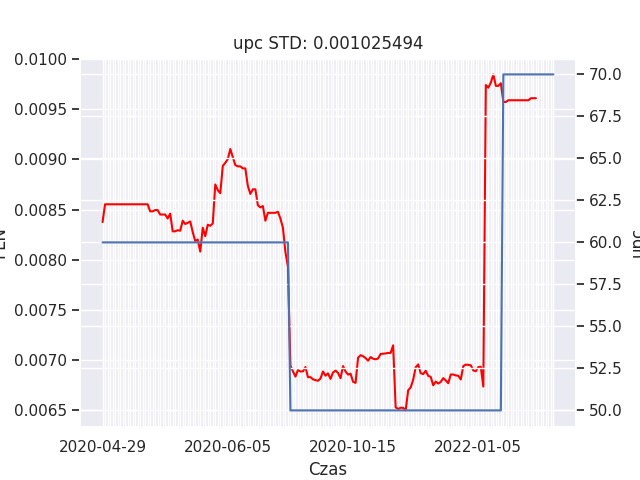
## pizza
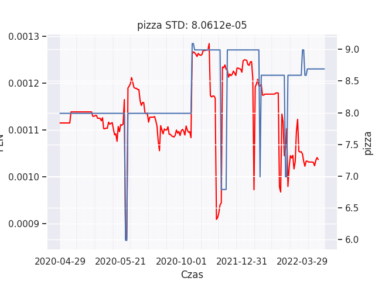
## prad
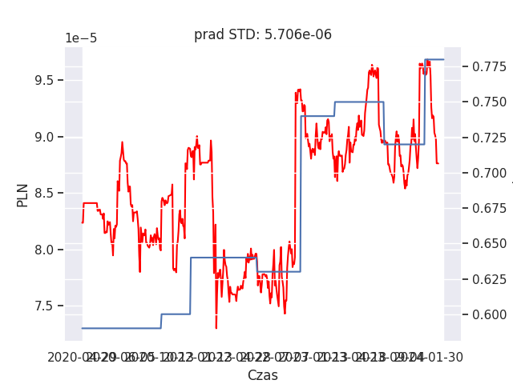
## rolex
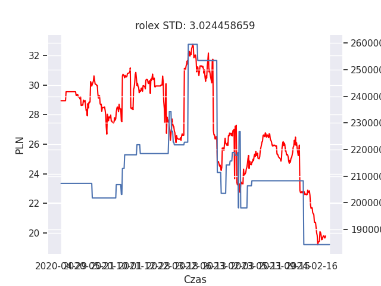
## whisky
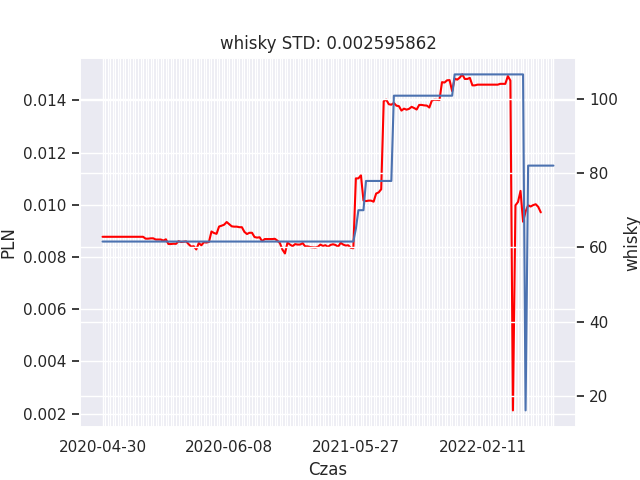
## kurczak
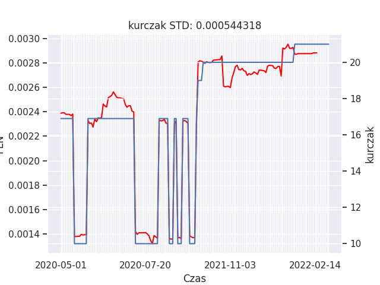
## telefon
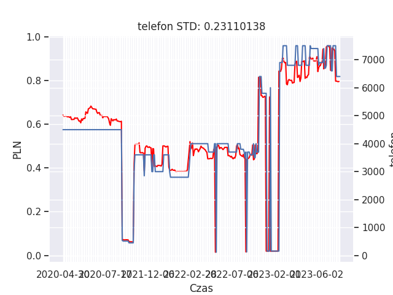
## piwo
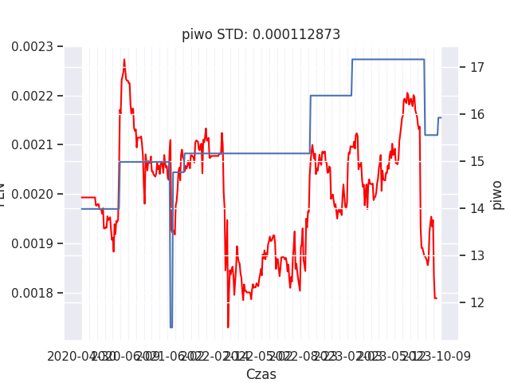
## lekarz_Mean
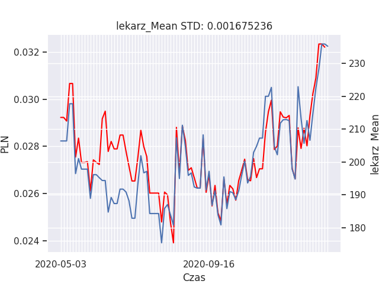
## lekarz_Median
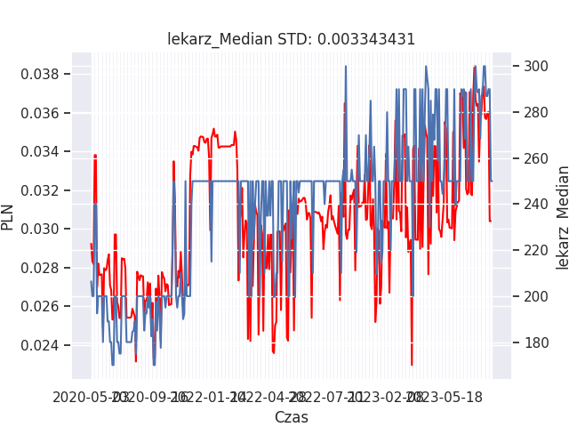
## kindle
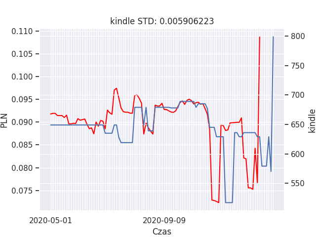
## m2wtorny
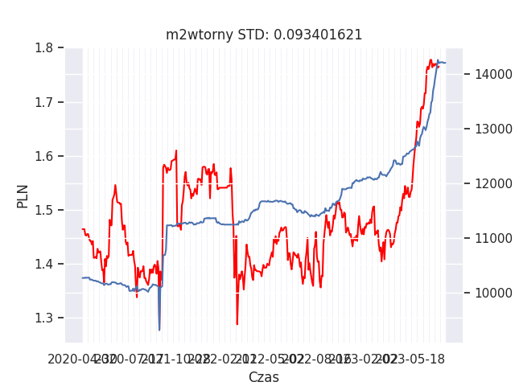
## m2pierwotny
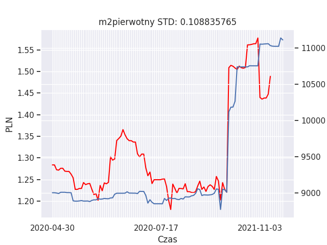
## chleb
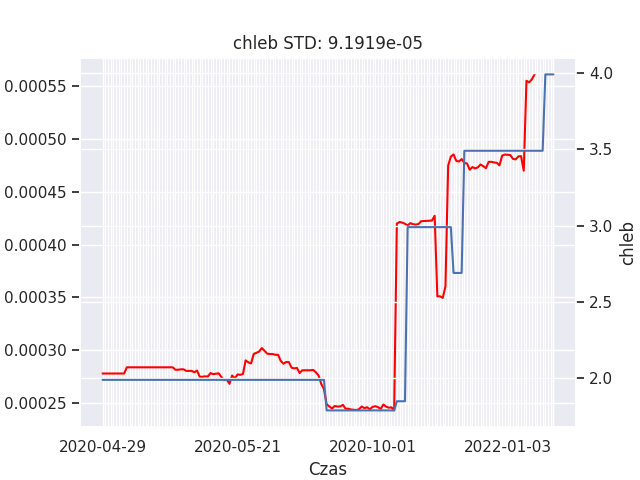
## jajka
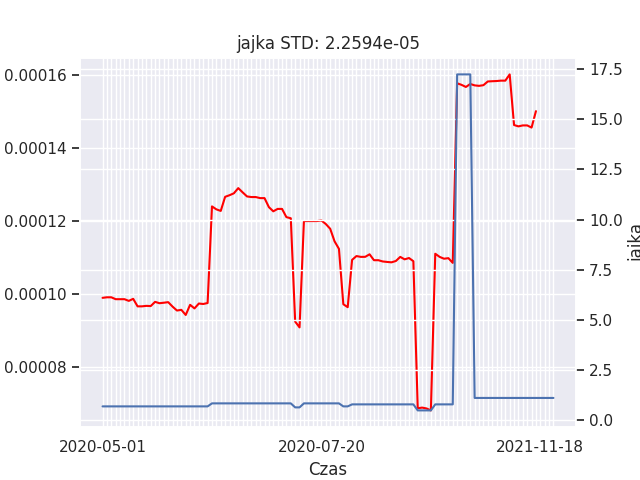
## karma
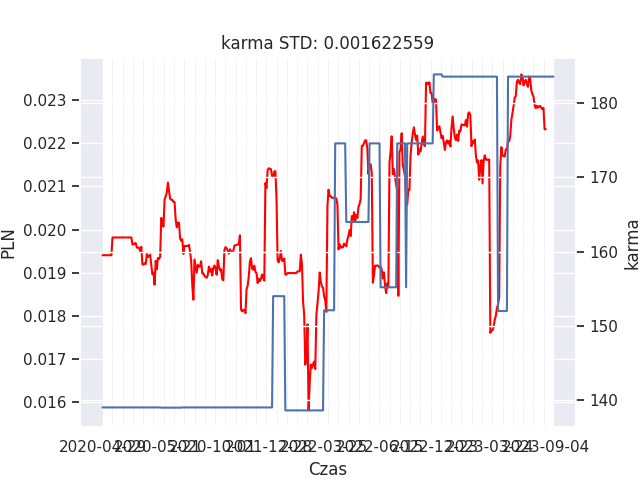
## chleb

## mydlo
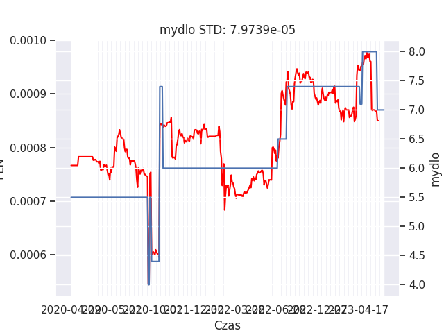
## karma

## benzyna
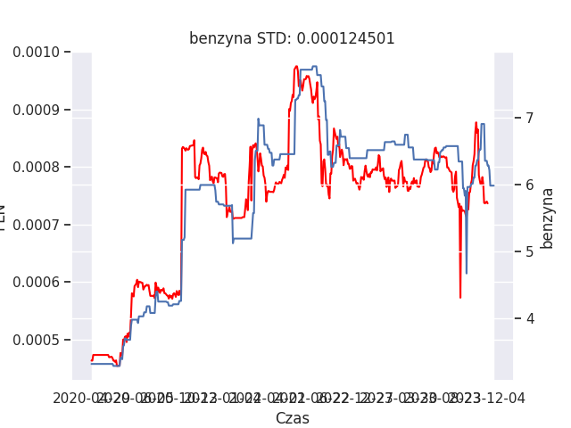
## auto_Mean
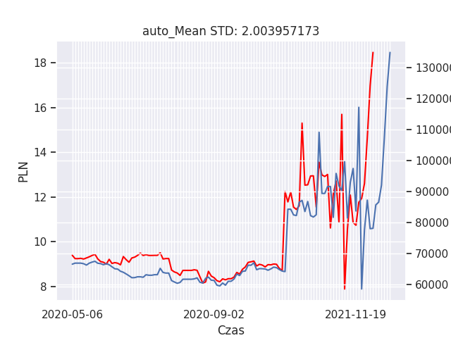
## auto_Median
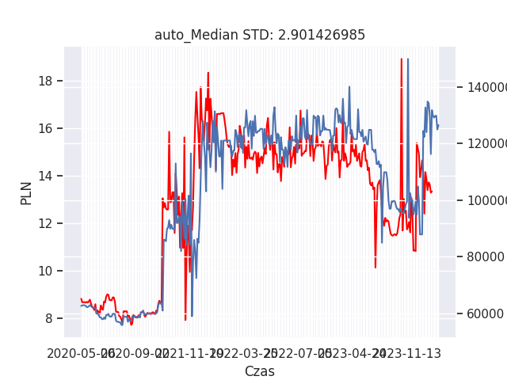
